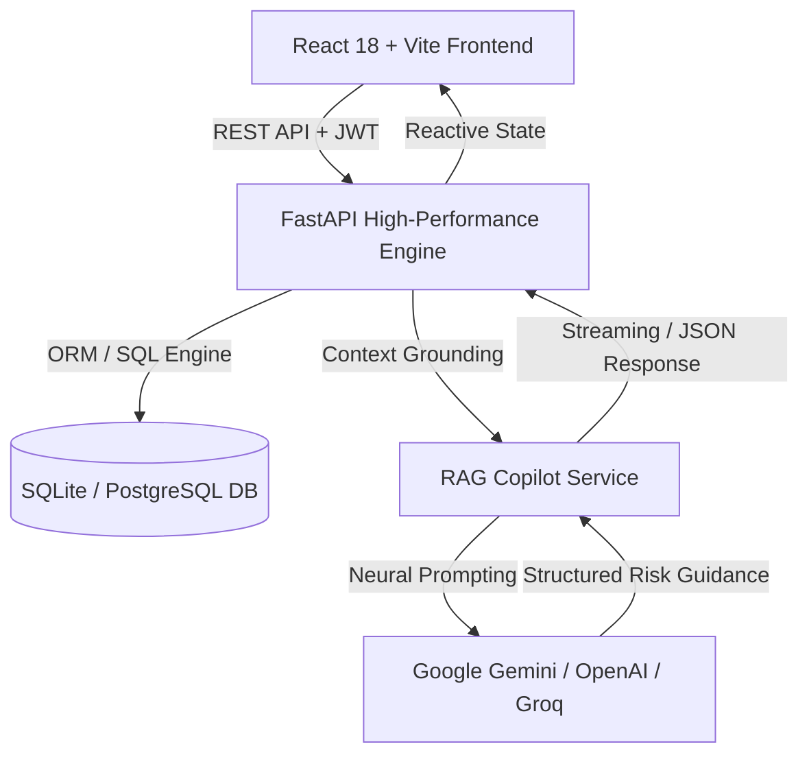

# Astra AI — Enterprise Risk & Regulatory Intelligence Platform

<p align="center">
  
</p>

<p align="center">
  <strong>Next-Generation Autonomous AML/KYC Surveillance, Transaction Anomaly Detection & Regulatory Copilot</strong>
</p>

<p align="center">
  <a href="#key-capabilities">Features</a> •
  <a href="#system-architecture">Architecture</a> •
  <a href="#quickstart">Quickstart</a> •
  <a href="#neural-copilot-engine">Neural Copilot</a> •
  <a href="#tech-stack">Tech Stack</a> •
  <a href="https://app.snowflake.com/streamlit/hdmwnml/pl45989/#/apps/qvozr5zbldf6ssazexoa"><strong>Live Snowflake App</strong></a>
</p>

<p align="center">
  <a href="https://app.snowflake.com/streamlit/hdmwnml/pl45989/#/apps/qvozr5zbldf6ssazexoa">
    
  </a>
</p>

---

## 🌟 Overview

**Astra AI** is an institutional-grade financial risk surveillance, anti-money laundering (AML), and regulatory intelligence platform. Built with a reactive design language featuring Apple SF Pro typography, smooth sliding collapsible navigation, dynamic dark/light 3D themes, and a state-of-the-art **Neural Copilot** powered by Google Gemini and live RAG database grounding.

---

## 🚀 Key Capabilities

- **🧠 Neural Risk Copilot (Gemini RAG Grounded)**:
  - Real-time reasoning across active compliance cases, high-risk customer profiles, and flagged transactions.
  - Multi-model fallback (`gemini-2.5-flash`, `gemini-3.8-flash`, OpenAI, Groq) with intelligent database grounding.
- **🛡️ Real-Time AML & Sanction Screening**:
  - Continuous surveillance of PEP lists, OFAC/FATF sanctions, and adverse media flags.
  - Multi-factor risk scoring engine for customer onboarding and periodic re-assessment.
- **⚡ High-Velocity Transaction Anomaly Engine**:
  - Live velocity and volume anomaly detection.
  - Automated threshold alerts (rapid layering, structurization, round-dollar spikes).
- **📋 Case Management & Audit Trail**:
  - End-to-end case tracking, evidence logging, and Suspicious Activity Report (SAR) preparation.
- **🎨 Premium Adaptive Interface**:
  - Apple SF Pro typographic hierarchy.
  - Seamless sliding collapsible sidebar with icon rail navigation.
  - Dual 3D faceted login themes (Dark Glassmorphic & Light Minimalist 3D Cubes).

---

## 🏗️ System Architecture



---

## 💻 Tech Stack

### Frontend
- **Framework**: React 18 with Vite
- **Styling**: Vanilla CSS Design System with Apple SF Pro font family
- **Icons**: Lucide React
- **Animations**: CSS Hardware-Accelerated Transforms & Transitions
- **State Management**: React Context & Hooks

### Backend
- **Core**: FastAPI (Python 3.10+) & Uvicorn
- **ORM**: SQLAlchemy 2.0
- **Validation**: Pydantic v2 & Pydantic-Settings
- **Intelligence**: Google Gemini Flash API (`google-genai` / REST RAG engine)

---

## ⚡ Quickstart

### Prerequisites
- Python 3.10+
- Node.js 18+ and npm
- (Optional) Google Gemini API Key

### 1. Clone Repository
```bash
git clone https://github.com/Nithingowda16/Astra-AI.git
cd Astra-AI
```

### 2. Configure Environment
Copy the example environment file and add your keys:
```bash
cp .env.example .env
```

Set your `GEMINI_API_KEY`:
```ini
GEMINI_API_KEY=your_gemini_api_key_here
```

### 3. Backend Setup
```bash
# Navigate to backend and install requirements
pip install -r backend/requirements.txt

# Start the FastAPI server
python -m uvicorn backend.app.main:app --host 127.0.0.1 --port 8000 --reload
```
API Documentation will be available at: `http://127.0.0.1:8000/docs`

### 4. Frontend Setup
```bash
# Navigate to frontend and install dependencies
cd frontend
npm install

# Start Vite development server
npm run dev
```
Access the application at `http://localhost:3000`

---

## 🔐 Default Access Profiles

| Role | Username | Password |
| :--- | :--- | :--- |
| **Senior Risk Officer** | `admin` | `password` |
| **Compliance Officer** | `officer` | `password` |

---

## 📄 License
Internal Enterprise & Research Software. All rights reserved.
